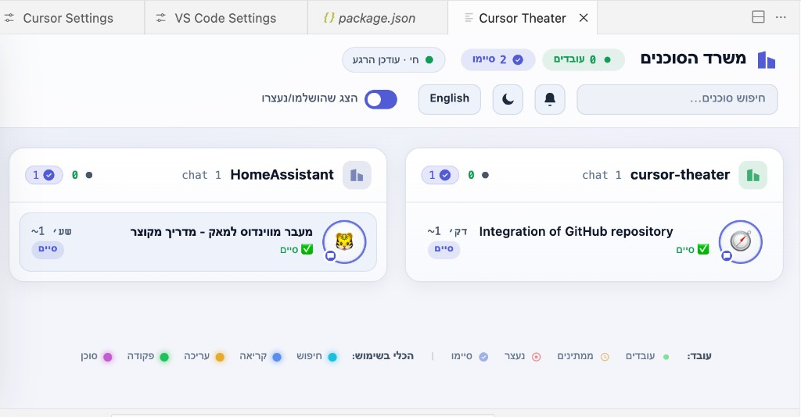
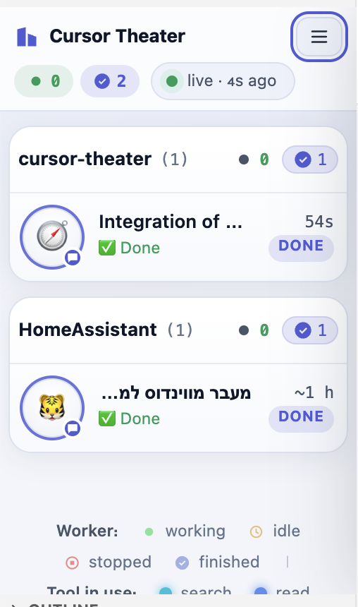

<!-- markdownlint-disable MD033 MD041 -->
<div align="center">

# 🎭 Cursor Theater

**Watch your Cursor agent conversations work — a live office, in real time.**

[](LICENSE)
[](https://github.com/udah1/cursor-theater/releases/latest)



<sub>Each Cursor instance/project is a room; every conversation inside it is a character at a desk — avatar, title, the tool it's using, and a timer. A community visualizer **for Cursor** — not affiliated with Anysphere.</sub>

</div>

Cursor Theater turns the conversations Cursor keeps for you into a glance: which
projects have agents **working**, which are **idle**, which **finished**, and what
each one is doing right now — without digging through transcripts.

It's a port of the excellent [Claude Theater](https://github.com/asafabram-ship-it/claude-theater)
by Asaf Abramzon, re-pointed at Cursor's data and shipped as a **native, server-less
Cursor extension**.

**Safe by design:** it runs entirely on your machine, **only reads** your local
journals, and sends nothing anywhere (no telemetry). The extension opens no port at
all. ([more](#privacy))

---

## What it looks like

Cursor Theater groups conversations **per Cursor instance / project** (a room), with
each conversation shown as a character at a desk. It works full-width in an editor
tab and stays readable docked in a narrow side bar.

<div align="center">

</div>

- Real chat **titles, status, and timestamps** (pulled from Cursor's `state.vscdb`).
- Per-room **show-finished** toggle and a bottom list of hidden, fully-finished rooms.
- A **status-bar item** with a live count of working agents — click for a quick menu.
- **Bilingual** UI: English by default, Hebrew one click away (layout flips to RTL).

## Install (Cursor extension — recommended)

The extension runs **no HTTP server and opens no port**: it reads
`~/.cursor/projects` and Cursor's global `state.vscdb` directly, watches them for
changes, and pushes updates into a webview.

**Install the prebuilt `.vsix`** — download `cursor-theater-<version>.vsix` from the
[latest release](https://github.com/udah1/cursor-theater/releases/latest), then in
Cursor run **Extensions: Install from VSIX…**, or from a terminal:

```bash
cursor --install-extension cursor-theater-<version>.vsix
```

After installing you get an **Activity Bar** view, a dockable **side-bar** view, a
**status-bar** item (bottom-right), and a full **editor-tab** command
(`Cursor Theater: Open in Editor`).

**Or build it from source** (needs Node.js):

```bash
git clone https://github.com/udah1/cursor-theater
cd cursor-theater/extension
npm install
npm run package        # produces cursor-theater-<version>.vsix
cursor --install-extension cursor-theater-*.vsix
```

## Standalone Python server (optional)

The extension is the primary path, but the original single-file Python server is
kept for two things the in-editor extension can't do:

- **View it in a real browser** — a browser tab can't read your transcripts, so it
  needs an HTTP source; the server provides one (the shared UI auto-switches to
  `fetch('/api/agents')` when it isn't running inside a webview).
- **Live UI development** — it serves `ui/theater.html` fresh on every request, so
  you can edit the UI and just refresh the browser.

```bash
python3 cursor_theater.py            # scans ~/.cursor and opens http://localhost:7333
python3 cursor_theater.py --demo     # synthetic office, no sessions needed
```

> Requires Python 3.9+. Binds to `127.0.0.1` only and is read-only.

## How it works

- The extension scans `~/.cursor/projects/**/*.jsonl` transcripts and reads chat
  **titles/status/timestamps** from Cursor's global `state.vscdb` via the read-only
  `sqlite3` CLI (`json_extract`, indexed — never loads the whole DB into memory). It
  degrades gracefully (first message + file mtime) if `sqlite3` is unavailable.
- The UI is a **single source of truth** at `ui/theater.html`. The Python server
  inlines it (`build_ui.py`) and the extension bundles it (`npm run copy-ui`), so
  both front ends render the exact same page.
- **No server in the extension**: data is pushed into the webview via `postMessage`.
  Each Cursor window runs its own extension host, so opening the theater in several
  windows is safe and independent — closing one never affects another.

## Privacy

Your journals contain real conversation content, so Cursor Theater keeps them local:

- The **extension opens no port** and makes no network calls.
- The optional Python server binds to **`127.0.0.1` only** and is read-only, with a
  loopback `Host` allowlist that blocks DNS-rebinding and a strict CSP.
- **No telemetry, ever.**

## Develop

```bash
# extension
cd extension && npm install && npm run compile   # then press F5 for an Extension Dev Host

# UI: edit ui/theater.html, then refresh the Python server in the browser.
# After a UI change, sync both consumers:
python3 build_ui.py        # inline into cursor_theater.py
cd extension && npm run copy-ui
```

> Note: the Python server and the extension have **separate scan implementations**
> (`cursor_theater.py` vs `extension/src/scan.ts`). If you change status/liveness
> logic, update both.

## Credit & License

Cursor Theater is a fork of
[Claude Theater](https://github.com/asafabram-ship-it/claude-theater) © Asaf
Abramzon, adapted for Cursor. The original is a community project for Claude Code,
not affiliated with Anthropic; this fork is a community project for Cursor, not
affiliated with Anysphere.

[MIT](LICENSE)
